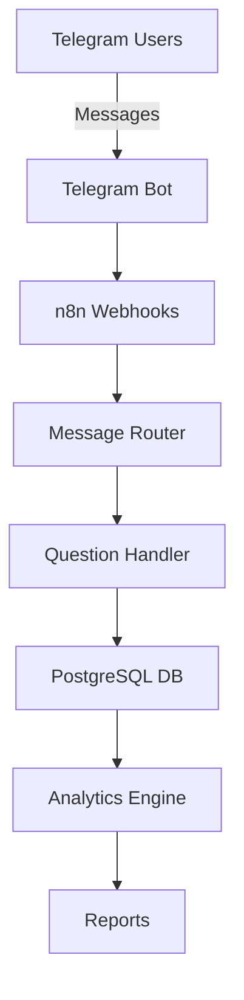

# 🤖 CFM Bot - Customer Feedback Management System

[](https://n8n.io)
[](https://postgresql.org)
[](https://t.me/CFmatch_bot)
[](https://github.com/Rivega42/cfm-bot)

## 📋 Overview

CFM Bot is a comprehensive customer feedback management system that automates the collection, processing, and analysis of customer feedback through Telegram integration and n8n workflows.

### 🎯 Key Features

- **Automated Feedback Collection**: Telegram bot for seamless user interaction
- **Smart Question Flow**: 40+ predefined questions with dynamic routing
- **Real-time Processing**: n8n workflows for immediate data handling
- **Analytics Dashboard**: Comprehensive feedback analysis and reporting
- **Multi-channel Support**: Extensible architecture for future integrations

## 🏗️ Architecture



## 🚀 Quick Start

### Prerequisites

- n8n instance (v1.108.2+)
- PostgreSQL database (v15+)
- Telegram Bot Token
- Node.js 18+ (for local development)

### Installation

1. **Clone the repository**
```bash
git clone https://github.com/Rivega42/cfm-bot.git
cd cfm-bot
```

2. **Set up the database**
```bash
cd database
psql -U your_user -d your_database -f schema.sql
```

3. **Configure environment variables**
```bash
cp .env.example .env
# Edit .env with your credentials
```

4. **Import n8n workflows**
- Navigate to your n8n instance
- Import workflows from `/workflows/*.json`

## 📁 Project Structure

```
cfm-bot/
├── workflows/           # n8n workflow JSON files
├── database/           # Database schemas and migrations
├── docs/              # Project documentation
├── telegram/          # Telegram bot configuration
├── tests/            # Test scenarios
├── README.md
├── CHANGELOG.md
└── TODO.md
```

## 📈 Development Progress

**Overall Progress: 35%**

- [x] Initial repository setup
- [x] Database schema design
- [x] Basic n8n workflow structure
- [x] Telegram bot integration
- [ ] Question flow implementation (40%)
- [ ] Analytics dashboard
- [ ] Automated reporting

## 📄 License

This project is licensed under the MIT License.

## 👥 Team

- **Project Lead**: @Rivega42
- **n8n Development**: In progress
- **Database Design**: Completed

---

**Last Updated**: September 4, 2025
**Version**: 0.3.5