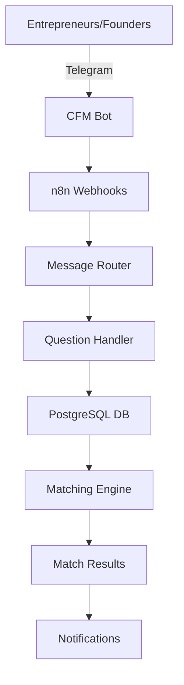

# 🤖 CFM Bot - Cofounder Matching System

[](https://n8n.io)
[](https://postgresql.org)
[](https://t.me/CFmatch_bot)
[](https://github.com/Rivega42/cfm-bot)

## 📋 Overview

CFM Bot is an intelligent cofounder matching system that helps entrepreneurs find their ideal business partners through a comprehensive questionnaire system via Telegram bot and automated matching algorithms.

### 🎯 Key Features

- **Smart Matching Algorithm**: 40+ questions to analyze compatibility between potential cofounders
- **Personality & Skills Assessment**: Deep profiling of technical skills, business acumen, and personality traits
- **Automated Telegram Bot**: Seamless user experience for data collection
- **Real-time Processing**: n8n workflows for immediate matching and notifications
- **Analytics Dashboard**: Comprehensive matching statistics and success metrics
- **Multi-language Support**: Russian and English interfaces

## 🏗️ Architecture



## 🚀 Quick Start

### Prerequisites

- n8n instance (v1.108.2+)
- PostgreSQL database (v15+)
- Telegram Bot Token
- Node.js 18+ (for local development)

### Installation

1. **Clone the repository**
```bash
git clone https://github.com/Rivega42/cfm-bot.git
cd cfm-bot
```

2. **Set up the database**
```bash
cd database
psql -U your_user -d your_database -f schema.sql
```

3. **Configure environment variables**
```bash
cp .env.example .env
# Edit .env with your credentials
```

4. **Import n8n workflows**
- Navigate to your n8n instance
- Import workflows from `/workflows/*.json`

## 📁 Project Structure

```
cfm-bot/
├── workflows/           # n8n workflow JSON files
├── database/           # Database schemas and migrations
├── docs/              # Project documentation
├── telegram/          # Telegram bot configuration
├── tests/            # Test scenarios
├── README.md
├── README.ru.md      # Russian documentation
├── CHANGELOG.md
└── TODO.md
```

## 🎯 Use Cases

- **Tech Startups**: Finding technical cofounders with complementary skills
- **Business Partnerships**: Matching business-oriented founders with technical experts
- **Industry-Specific Matching**: Connecting founders in specific industries
- **Skill Gap Filling**: Finding partners who complement your weaknesses

## 📈 Development Progress

**Overall Progress: 38%**

- [x] Initial repository setup
- [x] Database schema design
- [x] Basic n8n workflow structure
- [x] Telegram bot integration
- [x] 40 matching questions loaded
- [ ] Matching algorithm implementation (40%)
- [ ] Analytics dashboard
- [ ] Automated matching notifications
- [ ] Web interface

## 🧩 Question Categories

The system evaluates potential cofounders across multiple dimensions:

1. **Technical Skills**: Programming languages, frameworks, architecture
2. **Business Skills**: Marketing, sales, finance, operations
3. **Personality Traits**: Leadership style, work ethics, communication
4. **Vision & Goals**: Startup ideas, long-term objectives, exit strategies
5. **Practical Aspects**: Location, time commitment, investment capacity

## 📊 Matching Algorithm

The CFM matching algorithm considers:
- Complementary skills (technical + business)
- Compatible working styles
- Aligned vision and goals
- Practical compatibility (location, time, investment)
- Industry preferences

## 👥 Team

- **Project Lead**: @Rivega42
- **n8n Development**: In progress
- **Database Design**: Completed
- **Algorithm Design**: In development

## 📄 License

This project is licensed under the MIT License.

---

**Last Updated**: September 4, 2025
**Version**: 0.3.5
**Bot**: [@CFmatch_bot](https://t.me/CFmatch_bot)