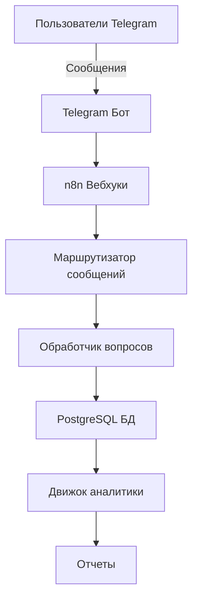

# 🤖 CFM Bot - Система Управления Обратной Связью

[](https://n8n.io)
[](https://postgresql.org)
[](https://t.me/CFmatch_bot)
[](https://github.com/Rivega42/cfm-bot)

## 📋 Обзор проекта

CFM Bot - это комплексная система управления обратной связью от клиентов, которая автоматизирует сбор, обработку и анализ отзывов через интеграцию с Telegram и рабочие процессы n8n.

### 🎯 Ключевые функции

- **Автоматизированный сбор отзывов**: Telegram бот для удобного взаимодействия с пользователями
- **Умная система вопросов**: 40+ предустановленных вопросов с динамической маршрутизацией
- **Обработка в реальном времени**: n8n workflows для мгновенной обработки данных
- **Панель аналитики**: Комплексный анализ и отчетность по обратной связи
- **Мультиканальная поддержка**: Расширяемая архитектура для будущих интеграций

## 🏗️ Архитектура



## 🚀 Быстрый старт

### Требования

- n8n инстанс (версия 1.108.2+)
- PostgreSQL база данных (версия 15+)
- Токен Telegram бота
- Node.js 18+ (для локальной разработки)

### Установка

1. **Клонирование репозитория**
```bash
git clone https://github.com/Rivega42/cfm-bot.git
cd cfm-bot
```

2. **Настройка базы данных**
```bash
cd database
psql -U ваш_пользователь -d ваша_база -f schema.sql
```

3. **Настройка переменных окружения**
```bash
cp .env.example .env
# Отредактируйте .env файл с вашими учетными данными
```

4. **Импорт n8n workflows**
- Перейдите в ваш n8n инстанс
- Импортируйте workflows из `/workflows/*.json`
- Настройте webhook URL и учетные данные

5. **Настройка Telegram webhook**
```bash
curl -X POST https://api.telegram.org/bot<ВАШ_ТОКЕН>/setWebhook \
  -H "Content-Type: application/json" \
  -d '{"url": "https://ваш-n8n-инстанс.com/webhook/telegram-bot"}'
```

## 📁 Структура проекта

```
cfm-bot/
├── workflows/           # JSON файлы n8n workflows
│   ├── main-router.json
│   ├── question-handler.json
│   └── analytics.json
├── database/           # Схемы БД и миграции
│   ├── schema.sql
│   ├── migrations/
│   └── backups/
├── docs/              # Документация проекта
│   ├── ARCHITECTURE.md
│   ├── API.md
│   └── SETUP.md
├── telegram/          # Конфигурация Telegram бота
│   ├── commands.json
│   └── messages.json
├── tests/            # Тестовые сценарии
│   ├── unit/
│   └── integration/
├── scripts/          # Утилиты и скрипты
│   ├── backup.sh
│   └── deploy.sh
├── README.md
├── README.ru.md      # Этот файл
├── CHANGELOG.md
├── TODO.md
└── .env.example
```

## 🔧 Конфигурация

### Переменные окружения

```env
# Настройки n8n
N8N_HOST=https://n8n.1int.tech
N8N_API_KEY=ваш_api_ключ
WORKFLOW_ID=82NNfa65ImefYweQ

# Telegram бот
TELEGRAM_BOT_TOKEN=токен_вашего_бота
TELEGRAM_BOT_USERNAME=CFmatch_bot

# База данных
DB_HOST=localhost
DB_PORT=5432
DB_NAME=cfm_database
DB_USER=ваш_пользователь
DB_PASSWORD=ваш_пароль

# Аналитика
ANALYTICS_ENABLED=true
REPORT_INTERVAL=daily
```

## 📊 Схема базы данных

Система использует PostgreSQL с комплексной схемой для управления обратной связью:

- **users**: Информация о пользователях Telegram
- **questions**: Банк вопросов с логикой маршрутизации
- **responses**: Ответы пользователей с временными метками
- **sessions**: Отслеживание сессий обратной связи
- **analytics**: Агрегированные данные аналитики

[Посмотреть полную схему](./database/schema.sql)

## 🔄 n8n Workflows

### Главный маршрутизатор (ID: 82NNfa65ImefYweQ)
Обрабатывает входящие сообщения Telegram и направляет их соответствующим обработчикам.

### Обработчик вопросов
Управляет потоком вопросов, сбором ответов и обновлением БД.

### Процессор аналитики
Генерирует отчеты и инсайты из собранной обратной связи.

## 📈 Прогресс разработки

- [x] Инициализация репозитория
- [x] Дизайн схемы БД
- [x] Базовая структура n8n workflows
- [x] Интеграция Telegram бота
- [ ] Реализация потока вопросов (40%)
- [ ] Панель аналитики
- [ ] Автоматизированная отчетность
- [ ] Мультиязычная поддержка
- [ ] Веб-интерфейс

**Общий прогресс: 35%**

## 🧪 Тестирование

```bash
# Запуск unit тестов
npm test

# Запуск интеграционных тестов
npm run test:integration

# Тестирование конкретного workflow
npm run test:workflow -- main-router
```

## 🤝 Вклад в проект

Мы приветствуем любой вклад в развитие проекта!

1. Форкните репозиторий
2. Создайте ветку для фичи (`git checkout -b feature/НоваяФича`)
3. Закоммитьте изменения (`git commit -m 'Добавлена НоваяФича'`)
4. Запушьте в ветку (`git push origin feature/НоваяФича`)
5. Откройте Pull Request

## 🐛 Известные проблемы

- Совместимость типа узла Message Router (используется структура Switch v3.2)
- Таймауты webhook при высоких нагрузках
- [Все проблемы](https://github.com/Rivega42/cfm-bot/issues)

## 📅 Дорожная карта

### IV квартал 2024
- ✅ Инициализация проекта
- ⏳ Реализация основного функционала
- ⏳ Базовая аналитика

### I квартал 2025
- 📋 Продвинутая аналитика
- 📋 Мультиканальная поддержка
- 📋 AI-инсайты

## 📄 Лицензия

Этот проект лицензирован под MIT License - см. файл [LICENSE](LICENSE) для деталей.

## 👥 Команда

- **Руководитель проекта**: @Rivega42
- **n8n разработка**: В процессе
- **Дизайн БД**: Завершен

## 🙏 Благодарности

- Сообщество n8n за платформу автоматизации workflows
- Документация Telegram Bot API
- Сообщество PostgreSQL

## 📞 Поддержка

- **Telegram бот**: [@CFmatch_bot](https://t.me/CFmatch_bot)
- **Проблемы**: [GitHub Issues](https://github.com/Rivega42/cfm-bot/issues)
- **Email**: support@cfm-bot.com

---

**Последнее обновление**: 4 сентября 2025
**Версия**: 0.3.5
**Статус сборки**: 🟡 В разработке