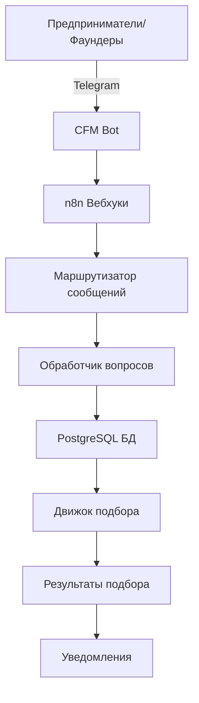

# 🤖 CFM Bot - Система поиска кофаундеров

[](https://n8n.io)
[](https://postgresql.org)
[](https://t.me/CFmatch_bot)
[](https://github.com/Rivega42/cfm-bot)

## 📋 Обзор проекта

CFM Bot (Cofounder Match Bot) - это интеллектуальная система поиска и подбора кофаундеров, которая помогает предпринимателям найти идеальных бизнес-партнеров через комплексную систему опросов в Telegram боте и автоматизированные алгоритмы подбора.

### 🎯 Ключевые функции

- **Умный алгоритм подбора**: 40+ вопросов для анализа совместимости потенциальных кофаундеров
- **Оценка личности и навыков**: Глубокое профилирование технических навыков, бизнес-компетенций и личностных качеств
- **Автоматизированный Telegram бот**: Удобный интерфейс для сбора данных
- **Обработка в реальном времени**: n8n workflows для мгновенного подбора и уведомлений
- **Панель аналитики**: Комплексная статистика подборов и метрики успеха
- **Мультиязычная поддержка**: Интерфейсы на русском и английском языках

## 🏗️ Архитектура



## 🚀 Быстрый старт

### Требования

- n8n инстанс (версия 1.108.2+)
- PostgreSQL база данных (версия 15+)
- Токен Telegram бота
- Node.js 18+ (для локальной разработки)

### Установка

1. **Клонирование репозитория**
```bash
git clone https://github.com/Rivega42/cfm-bot.git
cd cfm-bot
```

2. **Настройка базы данных**
```bash
cd database
psql -U ваш_пользователь -d ваша_база -f schema.sql
```

3. **Настройка переменных окружения**
```bash
cp .env.example .env
# Отредактируйте .env файл с вашими учетными данными
```

4. **Импорт n8n workflows**
- Перейдите в ваш n8n инстанс
- Импортируйте workflows из `/workflows/*.json`

## 📁 Структура проекта

```
cfm-bot/
├── workflows/           # JSON файлы n8n workflows
├── database/           # Схемы БД и миграции
├── docs/              # Документация проекта
├── telegram/          # Конфигурация Telegram бота
├── tests/            # Тестовые сценарии
├── scripts/          # Утилиты и скрипты
├── README.md         # Английская документация
├── README.ru.md      # Этот файл
├── CHANGELOG.md
└── TODO.md
```

## 🎯 Сценарии использования

- **Технологические стартапы**: Поиск технических кофаундеров с дополняющими навыками
- **Бизнес-партнерства**: Подбор бизнес-ориентированных фаундеров для технических специалистов
- **Отраслевой подбор**: Соединение фаундеров в конкретных индустриях
- **Заполнение пробелов в навыках**: Поиск партнеров, которые дополняют ваши слабые стороны

## 📈 Прогресс разработки

**Общий прогресс: 38%**

- [x] Инициализация репозитория
- [x] Дизайн схемы БД
- [x] Базовая структура n8n workflows
- [x] Интеграция Telegram бота
- [x] 40 вопросов для подбора загружены
- [ ] Реализация алгоритма подбора (40%)
- [ ] Панель аналитики
- [ ] Автоматизированные уведомления о подборе
- [ ] Веб-интерфейс

## 🧩 Категории вопросов

Система оценивает потенциальных кофаундеров по множеству параметров:

1. **Технические навыки**: Языки программирования, фреймворки, архитектура
2. **Бизнес-навыки**: Маркетинг, продажи, финансы, операции
3. **Личностные качества**: Стиль лидерства, рабочая этика, коммуникация
4. **Видение и цели**: Идеи стартапов, долгосрочные цели, стратегии выхода
5. **Практические аспекты**: Локация, временные затраты, инвестиционные возможности

## 📊 Алгоритм подбора

Алгоритм CFM учитывает:
- Дополняющие навыки (технические + бизнес)
- Совместимые стили работы
- Согласованное видение и цели
- Практическая совместимость (локация, время, инвестиции)
- Отраслевые предпочтения

## 🔄 Как это работает

1. **Регистрация**: Пользователь начинает с команды `/start` в Telegram боте
2. **Опрос**: Проходит через 40 вопросов о навыках, опыте и предпочтениях
3. **Анализ**: Система анализирует ответы и создает профиль фаундера
4. **Подбор**: Алгоритм находит наиболее подходящих кофаундеров
5. **Уведомление**: Обе стороны получают уведомления о потенциальном матче
6. **Коннект**: При взаимном интересе происходит обмен контактами

## 👥 Команда

- **Руководитель проекта**: @Rivega42
- **n8n разработка**: В процессе
- **Дизайн БД**: Завершен
- **Разработка алгоритма**: В процессе

## 🤝 Вклад в проект

Мы приветствуем любой вклад в развитие проекта!

1. Форкните репозиторий
2. Создайте ветку для фичи (`git checkout -b feature/НоваяФича`)
3. Закоммитьте изменения (`git commit -m 'Добавлена НоваяФича'`)
4. Запушьте в ветку (`git push origin feature/НоваяФича`)
5. Откройте Pull Request

## 📄 Лицензия

Этот проект лицензирован под MIT License.

## 📞 Поддержка

- **Telegram бот**: [@CFmatch_bot](https://t.me/CFmatch_bot)
- **Проблемы**: [GitHub Issues](https://github.com/Rivega42/cfm-bot/issues)
- **Email**: support@cfm-bot.com

---

**Последнее обновление**: 4 сентября 2025
**Версия**: 0.3.5
**Бот**: [@CFmatch_bot](https://t.me/CFmatch_bot)