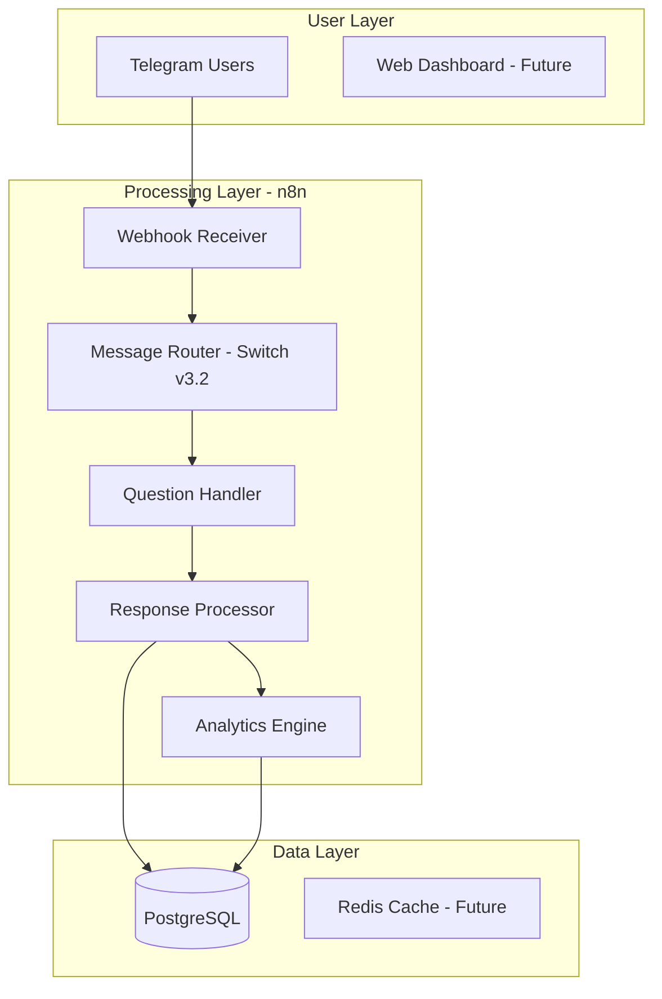

# 🏗️ CFM Bot Architecture

## System Overview

CFM Bot is built on a microservices-inspired architecture using n8n workflows as the orchestration layer, PostgreSQL for data persistence, and Telegram as the primary user interface.

## Architecture Diagram

## Component Details

### 1. Telegram Bot Interface
- **Bot Username**: @CFmatch_bot
- **Commands**: /start, /help, /status
- **Features**: Inline keyboards, callback queries

### 2. n8n Workflows
- **Instance URL**: https://n8n.1int.tech
- **Main Workflow ID**: 82NNfa65ImefYweQ
- **Version**: 1.108.2

### 3. Database
- **Type**: PostgreSQL v15+
- **Schema Version**: v3.0
- **Key Tables**: users, questions, sessions, responses, analytics

## Data Flow

1. User sends message to Telegram Bot
2. Webhook receives update
3. Message Router determines action
4. Question Handler manages flow
5. Response stored in database
6. Analytics processed

## Security

- TLS encryption for all connections
- Token-based authentication
- Rate limiting per user
- Input validation at all layers

## Scalability

- Horizontal scaling via n8n workers
- Database connection pooling
- Caching layer (planned)
- Load balancing (future)

---

Last Updated: September 4, 2025