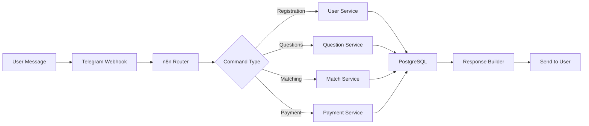

# 🏗️ CFM Bot Architecture v3.0

## 📋 Table of Contents
1. [System Overview](#system-overview)
2. [Architecture Layers](#architecture-layers)
3. [Database Architecture](#database-architecture)
4. [Component Architecture](#component-architecture)
5. [Data Flow](#data-flow)
6. [Integration Points](#integration-points)
7. [Scaling Strategy](#scaling-strategy)
8. [Security Architecture](#security-architecture)

## 🎯 System Overview

CFM Bot is a comprehensive cofounder matching platform built on a microservices architecture with the following core capabilities:

- **Multi-type Matching**: Pairs, teams (3-4 people), project-team matching
- **Interview System**: Automated HR interviews and assessments
- **Monetization**: Subscription-based with Robokassa payment integration
- **Multi-channel**: Telegram bot, Web interface (planned), Mobile app (planned)
- **AI-Powered**: Intelligent matching algorithms and conversation management

### System Capacity
- **Target Users**: 1,000+ concurrent users
- **Database Size**: 100MB - 1GB
- **Response Time**: < 100ms for queries
- **Uptime Target**: 99.9%

## 🏗️ Architecture Layers

### Layer 1: Presentation Layer
```
┌─────────────────────────────────────────────────┐
│              PRESENTATION LAYER                  │
├─────────────────────────────────────────────────┤
│  • Telegram Bot (@CFmatch_bot)                  │
│  • Web Application (React/Next.js) - Planned    │
│  • Mobile App (React Native) - Planned          │
│  • Admin Dashboard - Planned                    │
└─────────────────────────────────────────────────┘
```

**Technologies:**
- Telegram Bot API
- Webhook Pattern
- Inline Keyboards
- Rich Media Support

### Layer 2: Orchestration Layer
```
┌─────────────────────────────────────────────────┐
│              n8n ORCHESTRATION                   │
├─────────────────────────────────────────────────┤
│  Workflow ID: 82NNfa65ImefYweQ                  │
│  Instance: https://n8n.1int.tech                │
│                                                  │
│  Workflows:                                      │
│  • CFM.1 Main Router (Active)                   │
│  • CFM.2 Registration Flow                      │
│  • CFM.3 Question System                        │
│  • CFM.4 Matching Engine                        │
│  • CFM.5 Match Viewer                           │
│  • CFM.6 Contact Exchange                       │
│  • CFM.7 Payment Processing                     │
│  • CFM.8 Analytics Engine                       │
└─────────────────────────────────────────────────┘
```

**Key Features:**
- Event-driven architecture
- Async processing
- Error handling & retry logic
- Workflow versioning
- Real-time monitoring

### Layer 3: Business Logic Layer
```
┌─────────────────────────────────────────────────┐
│            BUSINESS LOGIC SERVICES               │
├─────────────────────────────────────────────────┤
│  User Service:                                   │
│  • Registration & Validation                     │
│  • Profile Management                            │
│  • Authentication                                │
│                                                  │
│  Matching Service:                               │
│  • Algorithm Execution                           │
│  • Score Calculation                             │
│  • Match Generation                              │
│                                                  │
│  Interview Service:                              │
│  • Question Flow Management                      │
│  • Response Processing                           │
│  • AI Evaluation                                 │
│                                                  │
│  Payment Service:                                │
│  • Subscription Management                       │
│  • Robokassa Integration                         │
│  • Transaction Processing                        │
└─────────────────────────────────────────────────┘
```

### Layer 4: Data Layer
```
┌─────────────────────────────────────────────────┐
│              POSTGRESQL DATABASE                 │
├─────────────────────────────────────────────────┤
│  Version: PostgreSQL 15                          │
│  Tables: 38                                      │
│  Indexes: 50+                                    │
│  Functions: 5+                                   │
│  Triggers: 3+                                    │
│  Views: 2+                                       │
└─────────────────────────────────────────────────┘
```

## 💾 Database Architecture

### Database Schema Categories

#### 1. User Management (4 tables)
```sql
users                 -- Core user accounts
user_profiles        -- Extended profiles
user_skills          -- Skills and expertise
user_types           -- User categorization
```

#### 2. Teams & Projects (3 tables)
```sql
teams                -- Team entities
team_members         -- Team composition
projects             -- Project registry
```

#### 3. Questions & Interviews (4 tables)
```sql
questions            -- Question bank (40 loaded)
user_answers         -- Response storage
interview_sessions   -- Session tracking
interview_results    -- AI evaluations
```

#### 4. Matching System (2 tables)
```sql
matches              -- Generated matches
match_interactions   -- User decisions
```

#### 5. Monetization (5 tables)
```sql
subscription_plans   -- Available plans
user_subscriptions   -- Active subscriptions
payments             -- Transaction records
robokassa_payments   -- Gateway specifics
payment_history      -- Audit trail
```

#### 6. Bot Communication (3 tables)
```sql
bot_sessions         -- Conversation tracking
bot_state            -- User state machine
notification_queue   -- Message queue
```

#### 7. Analytics (7 tables)
```sql
user_actions         -- Event tracking
match_analytics      -- Match performance
conversion_funnel    -- User journey
daily_reports        -- Aggregated metrics
user_scores          -- Reputation system
feedback             -- User feedback
system_metrics       -- Performance data
```

### Data Types & Standards
- **Primary Keys**: UUID v4
- **Timestamps**: WITH TIME ZONE
- **JSON Storage**: JSONB for flexible data
- **Arrays**: For multi-participant data
- **Full-text Search**: pg_trgm extension

## 🔧 Component Architecture

### Main Router Component
```javascript
// CFM.1 Main Router Workflow Structure
{
  "nodes": [
    "Telegram Webhook Trigger",
    "Event Parser",
    "Command Router (Switch)",
    "Database Connection",
    "Response Formatter",
    "Telegram Sender"
  ],
  "connections": {
    "linear": false,
    "branching": true,
    "error_handling": true
  }
}
```

### User Flow Components

#### Registration Flow
```
START → Check Existing User → 
  ├─[Exists]→ Load Profile → Continue
  └─[New]→ Create User → Set Type → 
           Create Profile → Welcome Message
```

#### Question Flow (3-Stage Process)
```
Stage 1: Basic Questions (1-10)
  ├─ Personal info
  └─ Basic preferences

Stage 2: Professional Questions (11-25)
  ├─ Skills assessment
  └─ Experience evaluation

Stage 3: Matching Questions (26-40)
  ├─ Team preferences
  └─ Project interests
```

#### Matching Algorithm
```
Input: User Answers + Preferences
  ↓
Score Calculation:
  • Skill Match: 30%
  • Interest Alignment: 25%
  • Experience Level: 20%
  • Location/Timezone: 15%
  • Personality Fit: 10%
  ↓
Output: Ranked Matches (Top 10)
```

## 🔄 Data Flow

### User Journey Flow


### Match Generation Flow
1. **Trigger**: User completes questions
2. **Processing**: 
   - Load user profile
   - Find potential matches
   - Calculate compatibility scores
   - Apply filters (subscription limits)
3. **Storage**: Save matches to database
4. **Notification**: Alert both parties
5. **Interaction**: Track accept/reject decisions

### Payment Processing Flow
1. **Initiation**: User selects plan
2. **Generation**: Create Robokassa invoice
3. **Redirect**: Send to payment page
4. **Webhook**: Receive payment confirmation
5. **Activation**: Update subscription
6. **Confirmation**: Send receipt

## 🔌 Integration Points

### External Services

#### Telegram Bot API
- **Webhook URL**: `/webhook/45e44e1c-f611-45e9-94f7-b2247b25b8db`
- **Methods Used**:
  - sendMessage
  - editMessageText
  - answerCallbackQuery
  - sendInvoice

#### Robokassa Payment Gateway
- **Endpoints**:
  - Init: `https://auth.robokassa.ru/Merchant/Index.aspx`
  - Result: `/webhook/robokassa/result`
  - Success: `/webhook/robokassa/success`
  - Fail: `/webhook/robokassa/fail`

#### Future Integrations
- OpenAI API (Advanced matching)
- SendGrid (Email notifications)
- Twilio (SMS verification)
- Google Calendar (Interview scheduling)

### Internal APIs

#### REST Endpoints
```
GET  /api/users/{id}
POST /api/users/register
PUT  /api/users/{id}/profile

GET  /api/questions/next
POST /api/questions/answer

GET  /api/matches/user/{id}
POST /api/matches/interact

POST /api/payments/create
GET  /api/payments/status/{id}
```

## 📈 Scaling Strategy

### Horizontal Scaling
- **n8n Workers**: Add worker instances
- **Database**: Read replicas for queries
- **Cache Layer**: Redis for session storage

### Vertical Scaling
- **Database**: Upgrade to larger instance
- **n8n**: Increase memory/CPU allocation

### Performance Optimization
- **Indexes**: All foreign keys indexed
- **Query Optimization**: Stored procedures for complex operations
- **Caching**: Frequently accessed data
- **Batch Processing**: Bulk operations for analytics

### Monitoring & Metrics
- **Application Metrics**:
  - Response times
  - Error rates
  - Throughput
- **Business Metrics**:
  - User acquisition
  - Match success rate
  - Conversion funnel
- **System Metrics**:
  - CPU/Memory usage
  - Database connections
  - Queue lengths

## 🔒 Security Architecture

### Authentication & Authorization
- **User Authentication**: Telegram ID validation
- **Session Management**: JWT tokens (future)
- **Role-based Access**: User, Admin, System

### Data Protection
- **Encryption at Rest**: PostgreSQL TDE
- **Encryption in Transit**: HTTPS/TLS
- **PII Handling**: GDPR compliance
- **Password Storage**: bcrypt hashing

### API Security
- **Rate Limiting**: 100 requests/minute
- **Input Validation**: All user inputs sanitized
- **SQL Injection**: Parameterized queries
- **XSS Protection**: Output encoding

### Payment Security
- **PCI Compliance**: Via Robokassa
- **Transaction Verification**: Signature validation
- **Audit Logging**: All payment events

### Backup & Recovery
- **Database Backups**: Daily automated
- **Point-in-time Recovery**: 7-day retention
- **Disaster Recovery**: Off-site backup storage
- **RTO Target**: 4 hours
- **RPO Target**: 1 hour

## 🚀 Deployment Architecture

### Production Environment
```
┌──────────────────┐     ┌──────────────────┐
│   Load Balancer  │────▶│   n8n Cluster    │
└──────────────────┘     └──────────────────┘
                               │
                               ▼
                         ┌──────────────────┐
                         │   PostgreSQL      │
                         │   Primary + Replica│
                         └──────────────────┘
```

### Infrastructure Requirements
- **n8n Server**: 4 CPU, 8GB RAM
- **PostgreSQL**: 2 CPU, 4GB RAM, 100GB SSD
- **Redis Cache**: 1 CPU, 2GB RAM
- **Monitoring**: Grafana + Prometheus

## 📊 Performance Targets

| Metric | Target | Current |
|--------|--------|---------|
| Response Time | < 100ms | - |
| Concurrent Users | 1000+ | - |
| Uptime | 99.9% | - |
| Match Calculation | < 500ms | - |
| Database Size | 1GB | ~50MB |
| Daily Active Users | 500+ | - |

## 🔄 Version History

- **v3.0.0** (Current): Complete architecture redesign
- **v2.0.0**: Basic matching system
- **v1.0.0**: MVP with registration only

---

**Last Updated**: 2025-09-04
**Version**: 3.0.0
**Status**: Active Development