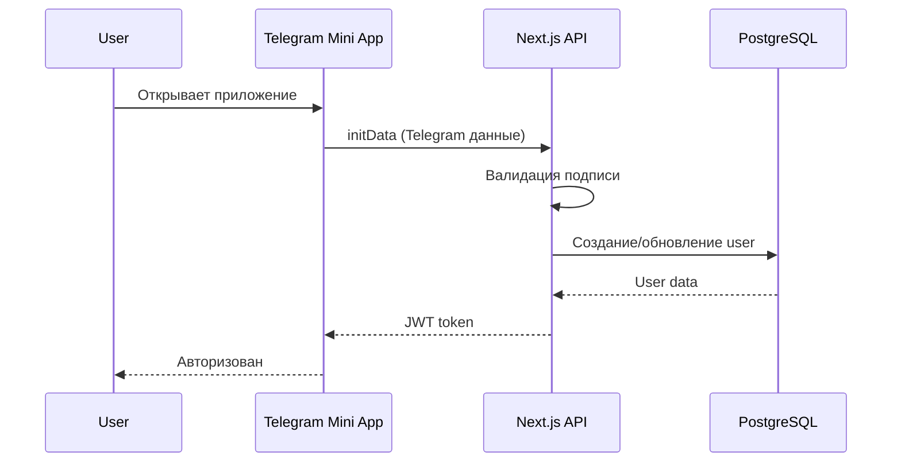

# 🏗️ Архитектура CFM Bot v4.0

## Обзор

CFM Bot построен на современном стеке с использованием Next.js 15, TypeScript, и Telegram Mini Apps.

## Технологический стек

### Frontend
```typescript
// Core
- Next.js 15.0 (App Router)
- TypeScript 5.0
- React 18.3

// State & Data
- Zustand (global state)
- TanStack Query (server state)
- tRPC Client (type-safe API)

// UI & Styling
- Tailwind CSS 3.4
- Radix UI (primitives)
- CVA (component variants)
- Framer Motion (animations)

// Telegram Integration
- @telegram-apps/sdk v2
- @telegram-apps/sdk-react v2
```

### Backend
```typescript
// Runtime & Framework
- Node.js 20 LTS
- Next.js API Routes
- tRPC v11 (API layer)

// Database & ORM
- PostgreSQL 15
- Prisma 6.0
- Redis 7 (cache)

// Auth & Security
- NextAuth.js v5
- JWT tokens
- bcrypt (password hashing)

// Background Jobs
- Bull Queue
- Redis (queue backend)

// Validation & Utils
- Zod (schema validation)
- date-fns (date handling)
- nanoid (ID generation)
```

## Архитектурные слои

### 1. Presentation Layer (UI)
```
src/
├── app/                     # Next.js App Router
│   ├── (auth)/             # Auth группа
│   ├── (dashboard)/        # Dashboard группа
│   └── telegram/           # Telegram Mini App
├── components/
│   ├── ui/                 # Базовые компоненты
│   ├── features/           # Фича-компоненты
│   └── layouts/            # Layouts
└── styles/                 # Глобальные стили
```

### 2. Application Layer (Business Logic)
```
src/
├── server/
│   ├── api/               # tRPC routers
│   │   ├── routers/      # API endpoints
│   │   └── trpc.ts       # tRPC setup
│   ├── services/         # Бизнес-логика
│   │   ├── auth/        # Аутентификация
│   │   ├── matching/    # Matching engine
│   │   ├── chat/        # Chat система
│   │   └── notifications/ # Уведомления
│   └── utils/           # Server utilities
```

### 3. Data Layer
```
src/
├── server/
│   ├── db/              # Database
│   │   ├── client.ts   # Prisma client
│   │   └── redis.ts    # Redis client
│   └── repositories/   # Data access
prisma/
├── schema.prisma       # Database schema
└── migrations/        # SQL migrations
```

## Основные компоненты

### Authentication Flow


### Matching System
```typescript
interface MatchingAlgorithm {
  // Основные критерии
  skills: number;        // Вес: 30%
  experience: number;    // Вес: 20%
  goals: number;        // Вес: 25%
  location: number;     // Вес: 15%
  availability: number; // Вес: 10%
}

// Scoring: 0-100
function calculateMatchScore(
  user1: Profile,
  user2: Profile
): number {
  // Детальный алгоритм в services/matching
}
```

### Real-time Features
```typescript
// WebSocket connections
interface RealtimeEvents {
  'match:new': { matchId: string };
  'message:new': { chatId: string; message: Message };
  'user:online': { userId: string };
  'user:typing': { chatId: string; userId: string };
}
```

## База данных

### Основные таблицы
```sql
-- Users & Profiles
users (id, telegram_id, created_at...)
profiles (user_id, bio, skills, goals...)

-- Matching
matches (id, user1_id, user2_id, score...)
user_actions (user_id, target_id, action...)

-- Communication
chats (id, match_id, created_at...)
messages (id, chat_id, sender_id, text...)

-- Subscriptions
subscriptions (id, user_id, plan, expires_at...)
payments (id, subscription_id, amount...)
```

### Индексы и оптимизация
```sql
-- Критичные индексы
CREATE INDEX idx_matches_users ON matches(user1_id, user2_id);
CREATE INDEX idx_messages_chat ON messages(chat_id, created_at DESC);
CREATE INDEX idx_user_actions ON user_actions(user_id, created_at DESC);
```

## Безопасность

### Authentication
- Telegram InitData валидация
- JWT с refresh tokens
- Session management через Redis

### Authorization
- Role-based access control (RBAC)
- Resource-level permissions
- API rate limiting

### Data Protection
- Encryption at rest (PostgreSQL)
- Encryption in transit (HTTPS)
- Personal data anonymization
- GDPR compliance

## Performance

### Оптимизации
1. **Database**
   - Connection pooling
   - Query optimization
   - Proper indexing
   - Materialized views для статистики

2. **Caching**
   - Redis для сессий
   - CDN для статики
   - API response caching
   - Database query caching

3. **Frontend**
   - Code splitting
   - Image optimization
   - Lazy loading
   - Service Worker

### Метрики
- TTFB < 200ms
- FCP < 1.5s
- TTI < 3.5s
- API response < 100ms (p95)

## Масштабирование

### Horizontal Scaling
```yaml
# Kubernetes deployment
apiVersion: apps/v1
kind: Deployment
metadata:
  name: cfm-bot-api
spec:
  replicas: 3  # Auto-scaling 3-10
  ...
```

### Database Scaling
- Read replicas для queries
- Write master для mutations
- Connection pooling via PgBouncer

### Caching Strategy
- L1: In-memory cache (Node.js)
- L2: Redis cache
- L3: CDN cache

## Monitoring & Observability

### Logging
- Structured logging (JSON)
- Log levels: ERROR, WARN, INFO, DEBUG
- Centralized via ELK stack

### Metrics
- Prometheus для метрик
- Grafana для визуализации
- Custom business metrics

### Tracing
- OpenTelemetry integration
- Distributed tracing
- Performance profiling

### Error Tracking
- Sentry для production
- Source maps для debugging
- User session replay

## Deployment

### Environments
1. **Development** - Local Docker
2. **Staging** - Vercel Preview
3. **Production** - Vercel/VPS

### CI/CD Pipeline
```yaml
# GitHub Actions
name: Deploy
on:
  push:
    branches: [main]
jobs:
  test:
    # Run tests
  build:
    # Build application
  deploy:
    # Deploy to Vercel
```

### Infrastructure as Code
```terraform
# Terraform configuration
resource "vercel_project" "cfm_bot" {
  name = "cfm-bot"
  framework = "nextjs"
  ...
}
```

## Disaster Recovery

### Backup Strategy
- Database: Daily snapshots
- Files: S3 versioning
- Code: Git history

### RTO/RPO
- RTO: 1 hour
- RPO: 15 minutes

### Failover
- Database: Automatic failover to replica
- Application: Multi-region deployment
- Cache: Redis Sentinel

---

*Последнее обновление: 2025-01-10*