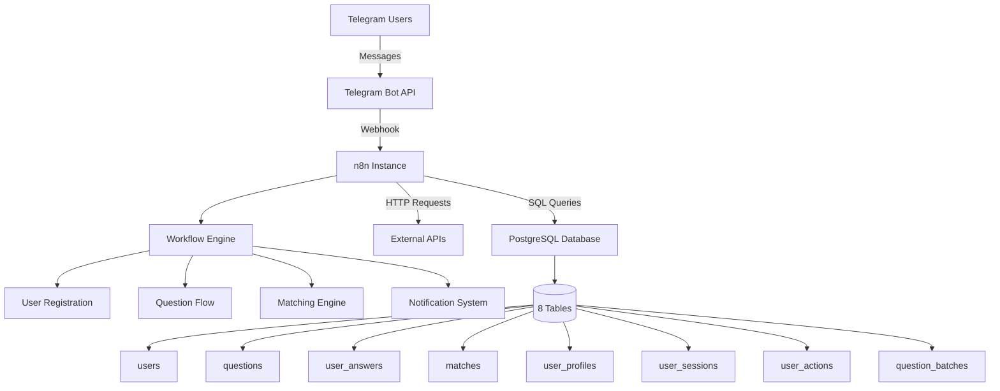

# 🏗 CFM Bot Architecture

## System Overview

CFM Bot is built on a microservice architecture using n8n as the workflow orchestrator, PostgreSQL for data persistence, and Telegram as the user interface.

## Architecture Diagram



## Components

### 1. Telegram Bot Layer

**Purpose**: User interface and interaction point

**Components**:
- Bot Token: `6864357679:AAGneJy48H7CfeBpgOSYsWjwIGv4KUNf7x0`
- Username: `@CFmatch_bot`
- Commands: `/start`, `/profile`, `/matches`, `/help`

**Features**:
- Inline keyboards for question answers
- Callback query handling
- Rich message formatting
- File/image support

### 2. n8n Workflow Layer

**Purpose**: Business logic and process automation

**Key Workflows**:

| ID | Name | Purpose |
|----|------|----------|
| 82NNfa65ImefYweQ | CFM Bot v8 | Main message router |
| CFM.2 | User Registration | New user onboarding |
| CFM.3 | Question Flow | Question presentation |
| CFM.4 | Matching Engine | Calculate compatibility |
| CFM.5 | Match Viewer | Display matches |
| CFM.6 | Contact Exchange | Share contact info |

**Node Types Used**:
- `nodes-base.webhook` - Receive Telegram webhooks
- `nodes-base.telegramTrigger` - Handle Telegram events
- `nodes-base.postgres` - Database operations
- `nodes-base.code` - Custom JavaScript logic
- `nodes-base.httpRequest` - API calls
- `nodes-base.if` - Conditional logic
- `nodes-base.switch` - Message routing

### 3. Database Layer

**Purpose**: Data persistence and retrieval

**Schema Overview**:

```sql
-- Core Tables
users              -- User accounts and states
questions          -- Question bank (40+ questions)
user_answers       -- User responses to questions
matches            -- Calculated match pairs

-- Support Tables
user_profiles      -- Extended user information
user_sessions      -- Active session tracking
user_actions       -- Activity logging
question_batches   -- Question grouping
```

**Key Relationships**:
- `users` 1:N `user_answers`
- `users` 1:N `matches`
- `questions` 1:N `user_answers`
- `users` 1:1 `user_profiles`

## Data Flow

### 1. User Registration Flow

```
User sends /start 
  → Webhook receives message
  → Check if user exists in DB
  → If new: Create user record
  → Start onboarding flow
  → Present first question batch
```

### 2. Question Answering Flow

```
User receives question
  → Display with inline keyboard
  → User selects answer
  → Store in user_answers
  → Calculate importance
  → Ask about partner preference
  → Load next question
  → Check batch completion
```

### 3. Matching Flow

```
Batch completion triggers matching
  → Find users with similar answers
  → Calculate compatibility score
  → Apply importance weights
  → Store in matches table
  → Notify both users
  → Present match cards
```

## Security Considerations

1. **Authentication**
   - Telegram user ID verification
   - Session token management
   - Rate limiting per user

2. **Data Protection**
   - Personal data encryption
   - Secure credential storage
   - SQL injection prevention

3. **Privacy**
   - Contact info only shared on mutual match
   - Anonymous matching until consent
   - Data deletion on request

## Scalability

### Current Limitations
- Single n8n instance
- Single PostgreSQL database
- Synchronous processing

### Future Improvements
- n8n clustering
- Database read replicas
- Redis caching layer
- Message queue for async processing
- CDN for media files

## Monitoring

### Metrics to Track
- Response time per workflow
- Database query performance
- User engagement rates
- Match success rates
- Error rates by component

### Health Checks
- Webhook availability
- Database connectivity
- n8n workflow status
- External API availability

## Technology Stack

| Component | Technology | Version |
|-----------|------------|----------|
| Workflow Engine | n8n | 1.108.2 |
| Database | PostgreSQL | 15 |
| Runtime | Node.js | 18+ |
| Bot Framework | Telegram Bot API | Latest |
| Container | Docker | Optional |

## API Endpoints

### Webhooks

| Endpoint | Purpose |
|----------|----------|
| `/webhook/45e44e1c-f611-45e9-94f7-b2247b25b8db` | Main bot webhook |
| `/webhook/cfm-question-flow` | Question flow handler |
| `/webhook/cfm-matching` | Matching engine trigger |

### Internal APIs

All internal communication happens through n8n workflows and PostgreSQL.

## Deployment Architecture

### Production Setup

```
Load Balancer
      │
      │
  n8n Cluster
      │
      │
PostgreSQL Primary
      │
      │
PostgreSQL Replica
```

### Development Setup

```
Local n8n
    │
    │
Local PostgreSQL
    │
    │
ngrok Tunnel
    │
    │
Telegram API
```

---

**Document Version**: 1.0.0
**Last Updated**: 2025-09-04
**Author**: CFM Bot Development Team