# 📊 CFM Database Schema v3.0 - Entity Relationship Diagram

## 🗄️ Complete Database Structure (38 Tables)

```mermaid
erDiagram
    %% User Management Tables
    users ||--o{ user_profiles : has
    users ||--o{ user_skills : has
    users ||--o{ user_types : belongs_to
    users ||--o{ user_answers : submits
    users ||--o{ bot_sessions : has
    users ||--o{ bot_state : has
    users ||--o{ user_subscriptions : has
    users ||--o{ matches : participates_in
    users ||--o{ team_members : is_member
    users ||--o{ projects : owns
    users ||--o{ user_actions : performs
    users ||--o{ feedback : provides
    
    %% Teams and Projects
    teams ||--o{ team_members : has
    teams ||--o{ matches : participates_in
    projects ||--o{ matches : seeks_team
    
    %% Questions System
    questions ||--o{ user_answers : has_answers
    questions ||--o{ question_categories : belongs_to
    
    %% Interview System
    interview_sessions ||--o{ interview_results : produces
    interview_sessions }o--|| users : conducted_for
    interview_templates ||--o{ interview_sessions : uses
    
    %% Matching System
    matches ||--o{ match_interactions : has
    matches ||--o{ match_analytics : tracked_by
    match_batches ||--o{ matches : contains
    
    %% Payment System
    subscription_plans ||--o{ user_subscriptions : offers
    user_subscriptions ||--o{ payments : generates
    payments ||--o{ robokassa_payments : processed_by
    payments ||--o{ payment_history : logged_in
    
    %% Communication
    bot_sessions ||--o{ messages : contains
    notification_queue ||--o{ notification_templates : uses
    
    %% Analytics
    user_scores ||--|| users : rates
    conversion_funnel ||--o{ user_actions : tracks
    daily_reports ||--o{ system_metrics : aggregates

    %% Table Definitions
    users {
        uuid id PK
        bigint telegram_id UK
        varchar username
        varchar first_name
        varchar last_name
        varchar email UK
        varchar phone
        varchar user_type
        timestamp created_at
        timestamp updated_at
        boolean is_active
        jsonb metadata
    }

    user_profiles {
        uuid id PK
        uuid user_id FK
        text bio
        varchar location
        varchar timezone
        date birth_date
        varchar gender
        varchar[] languages
        jsonb social_links
        varchar avatar_url
        integer experience_years
        varchar[] industries
        varchar company
        varchar position
        jsonb preferences
        timestamp updated_at
    }

    user_skills {
        uuid id PK
        uuid user_id FK
        varchar category
        varchar[] skills
        jsonb skill_levels
        boolean is_primary
        timestamp created_at
    }

    user_types {
        uuid id PK
        uuid user_id FK
        varchar type_name
        jsonb type_config
        boolean is_active
        timestamp activated_at
    }

    teams {
        uuid id PK
        varchar name
        text description
        uuid owner_id FK
        integer max_members
        varchar status
        jsonb team_config
        timestamp created_at
        timestamp updated_at
    }

    team_members {
        uuid id PK
        uuid team_id FK
        uuid user_id FK
        varchar role
        varchar status
        timestamp joined_at
        timestamp left_at
    }

    projects {
        uuid id PK
        varchar title
        text description
        uuid owner_id FK
        varchar status
        varchar[] required_skills
        integer team_size_needed
        jsonb project_details
        timestamp created_at
        timestamp deadline
    }

    questions {
        uuid id PK
        integer question_number
        varchar category
        text question_text
        varchar input_type
        jsonb options
        boolean is_required
        integer weight
        varchar stage
        boolean is_active
        timestamp created_at
    }

    user_answers {
        uuid id PK
        uuid user_id FK
        uuid question_id FK
        jsonb answer_value
        integer score
        timestamp answered_at
        timestamp updated_at
    }

    matches {
        uuid id PK
        uuid[] participant_ids
        varchar match_type
        decimal compatibility_score
        jsonb match_details
        varchar status
        uuid batch_id FK
        timestamp created_at
        timestamp expires_at
    }

    match_interactions {
        uuid id PK
        uuid match_id FK
        uuid user_id FK
        varchar action
        text message
        timestamp interacted_at
    }

    subscription_plans {
        uuid id PK
        varchar name
        text description
        decimal price_monthly
        integer matches_limit
        integer messages_limit
        jsonb features
        boolean is_active
        timestamp created_at
    }

    user_subscriptions {
        uuid id PK
        uuid user_id FK
        uuid plan_id FK
        varchar status
        timestamp started_at
        timestamp expires_at
        timestamp cancelled_at
        jsonb subscription_data
    }

    payments {
        uuid id PK
        uuid user_id FK
        uuid subscription_id FK
        decimal amount
        varchar currency
        varchar status
        varchar payment_method
        jsonb payment_data
        timestamp created_at
        timestamp processed_at
    }

    bot_sessions {
        uuid id PK
        uuid user_id FK
        varchar session_key UK
        jsonb session_data
        timestamp started_at
        timestamp last_activity
        timestamp expired_at
    }

    bot_state {
        uuid id PK
        uuid user_id FK
        varchar current_state
        varchar previous_state
        jsonb state_data
        timestamp updated_at
    }

    notification_queue {
        uuid id PK
        uuid user_id FK
        varchar notification_type
        jsonb payload
        varchar status
        integer retry_count
        timestamp scheduled_at
        timestamp sent_at
    }

    user_actions {
        uuid id PK
        uuid user_id FK
        varchar action_type
        jsonb action_data
        varchar ip_address
        varchar user_agent
        timestamp created_at
    }

    user_scores {
        uuid id PK
        uuid user_id FK
        decimal reputation_score
        integer total_matches
        integer successful_matches
        decimal response_rate
        jsonb score_breakdown
        timestamp calculated_at
    }

    daily_reports {
        uuid id PK
        date report_date
        integer new_users
        integer active_users
        integer matches_created
        decimal total_revenue
        jsonb detailed_metrics
        timestamp generated_at
    }

    feedback {
        uuid id PK
        uuid user_id FK
        varchar feedback_type
        integer rating
        text comments
        jsonb metadata
        timestamp created_at
    }
```



## 🎨 Color-Coded Schema Groups

```
┌─────────────────────────────────────────────────────────┐
│                    USER MANAGEMENT                       │
│  🟦 users, user_profiles, user_skills, user_types       │
└─────────────────────────────────────────────────────────┘

┌─────────────────────────────────────────────────────────┐
│                    TEAMS & PROJECTS                      │
│  🟩 teams, team_members, projects                        │
└─────────────────────────────────────────────────────────┘

┌─────────────────────────────────────────────────────────┐
│                    QUESTIONS & INTERVIEWS                │
│  🟨 questions, user_answers, interview_sessions,         │
│     interview_results, interview_templates               │
└─────────────────────────────────────────────────────────┘

┌─────────────────────────────────────────────────────────┐
│                    MATCHING SYSTEM                       │
│  🟧 matches, match_interactions, match_batches,          │
│     match_analytics                                      │
└─────────────────────────────────────────────────────────┘

┌─────────────────────────────────────────────────────────┐
│                    MONETIZATION                          │
│  💰 subscription_plans, user_subscriptions, payments,    │
│     robokassa_payments, payment_history                  │
└─────────────────────────────────────────────────────────┘

┌─────────────────────────────────────────────────────────┐
│                    BOT COMMUNICATION                     │
│  🤖 bot_sessions, bot_state, messages,                   │
│     notification_queue, notification_templates           │
└─────────────────────────────────────────────────────────┘

┌─────────────────────────────────────────────────────────┐
│                    ANALYTICS                             │
│  📊 user_actions, user_scores, conversion_funnel,        │
│     daily_reports, system_metrics, feedback              │
└─────────────────────────────────────────────────────────┘
```

## 🔗 Relationship Types

### One-to-One (1:1)
- `users` ↔ `user_scores`
- `users` ↔ `bot_state`

### One-to-Many (1:N)
- `users` → `user_profiles`
- `users` → `user_skills`
- `users` → `user_answers`
- `users` → `payments`
- `teams` → `team_members`
- `questions` → `user_answers`
- `subscription_plans` → `user_subscriptions`
- `matches` → `match_interactions`

### Many-to-Many (M:N)
- `users` ↔ `matches` (via participant_ids array)
- `users` ↔ `teams` (via team_members)

## 🔑 Key Indexes

### Performance Indexes
```sql
-- User lookups
CREATE INDEX idx_users_telegram_id ON users(telegram_id);
CREATE INDEX idx_users_email ON users(email);

-- Matching queries
CREATE INDEX idx_matches_participant_ids ON matches USING GIN(participant_ids);
CREATE INDEX idx_matches_status ON matches(status);
CREATE INDEX idx_matches_created_at ON matches(created_at DESC);

-- Question flow
CREATE INDEX idx_user_answers_user_question ON user_answers(user_id, question_id);
CREATE INDEX idx_questions_stage ON questions(stage, question_number);

-- Payment queries
CREATE INDEX idx_payments_user_status ON payments(user_id, status);
CREATE INDEX idx_user_subscriptions_expires ON user_subscriptions(expires_at);

-- Analytics
CREATE INDEX idx_user_actions_created ON user_actions(created_at DESC);
CREATE INDEX idx_daily_reports_date ON daily_reports(report_date DESC);
```

### Full-Text Search Indexes
```sql
-- Profile search
CREATE INDEX idx_user_profiles_bio_fts ON user_profiles USING GIN(to_tsvector('english', bio));

-- Project search
CREATE INDEX idx_projects_description_fts ON projects USING GIN(to_tsvector('english', description));

-- Skills search
CREATE INDEX idx_user_skills_gin ON user_skills USING GIN(skills);
```

## 📐 Database Constraints

### Unique Constraints
- `users.telegram_id` - One account per Telegram user
- `users.email` - Unique email addresses
- `bot_sessions.session_key` - Unique session identifiers

### Check Constraints
```sql
-- Score validations
ALTER TABLE matches ADD CONSTRAINT chk_score_range 
  CHECK (compatibility_score >= 0 AND compatibility_score <= 100);

-- Status enums
ALTER TABLE matches ADD CONSTRAINT chk_match_status 
  CHECK (status IN ('pending', 'accepted', 'rejected', 'expired'));

-- Positive amounts
ALTER TABLE payments ADD CONSTRAINT chk_positive_amount 
  CHECK (amount > 0);
```

### Foreign Key Constraints
All foreign keys have:
- `ON DELETE CASCADE` for dependent records
- `ON UPDATE CASCADE` for ID changes
- Indexed for performance

## 🚀 Database Optimization

### Partitioning Strategy
```sql
-- Partition large tables by date
CREATE TABLE user_actions_2025_01 PARTITION OF user_actions
  FOR VALUES FROM ('2025-01-01') TO ('2025-02-01');

-- Partition matches by status
CREATE TABLE matches_active PARTITION OF matches
  FOR VALUES IN ('pending', 'accepted');
```

### Archival Strategy
- Move expired matches after 90 days
- Archive old user_actions monthly
- Compress payment_history quarterly

### Performance Tuning
```sql
-- Connection pooling
max_connections = 200
shared_buffers = 256MB
effective_cache_size = 1GB

-- Query optimization
work_mem = 4MB
maintenance_work_mem = 64MB
random_page_cost = 1.1
```

## 📊 Database Statistics

| Metric | Value |
|--------|-------|
| Total Tables | 38 |
| Total Columns | 400+ |
| Total Indexes | 50+ |
| Stored Functions | 5 |
| Triggers | 3 |
| Views | 2 |
| Estimated Size (1 year) | 500MB-1GB |
| Max Connections | 200 |
| Average Query Time Target | < 50ms |

## 🔄 Migration Path from v2.0

### New Tables in v3.0
1. **User Management**: `user_types`
2. **Teams**: `teams`, `team_members`, `projects`
3. **Interviews**: `interview_sessions`, `interview_templates`, `interview_results`, `question_categories`
4. **Matching**: `match_batches`, `match_analytics`
5. **Payments**: `robokassa_payments`, `payment_history`
6. **Bot**: `messages`, `notification_templates`
7. **Analytics**: `conversion_funnel`, `daily_reports`, `system_metrics`

### Modified Tables
- `users`: Added JSONB metadata field
- `matches`: Added participant_ids array for multi-user matches
- `user_profiles`: Added team preferences
- `questions`: Added stage field for 3-stage flow

### Data Migration Script
```sql
-- Run migration from v2.0 to v3.0
BEGIN;

-- Backup existing data
CREATE TABLE users_backup AS SELECT * FROM users;

-- Run migration script
\i database/migrations/002_update_to_v3.sql

-- Verify data integrity
SELECT COUNT(*) FROM users;
SELECT COUNT(*) FROM users_backup;

-- If all good, commit
COMMIT;

-- Otherwise rollback
-- ROLLBACK;
```

---

**Generated**: 2025-09-04  
**Version**: 3.0.0  
**Database**: PostgreSQL 15  
**Schema Status**: Production Ready