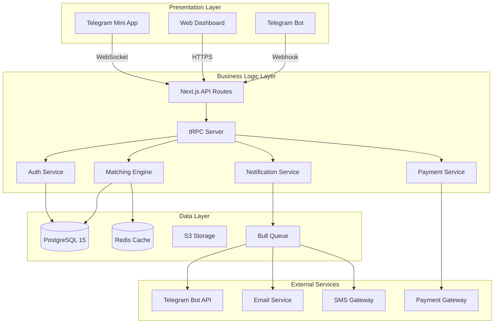
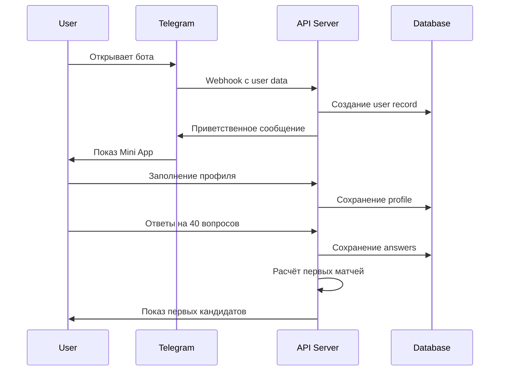
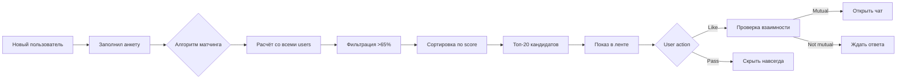
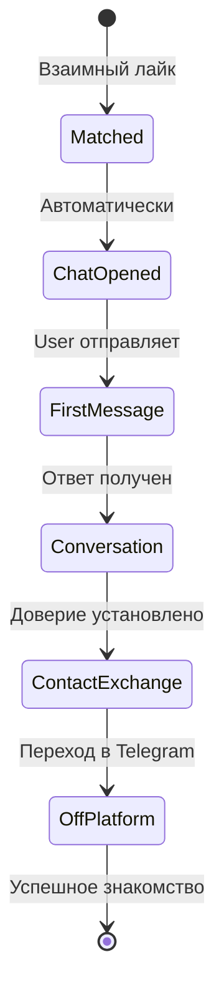

# 📚 CFM Bot - Полное описание системы подбора кофаундеров

## 🎯 Обзор системы

**CFM Bot (CoFounder Matching Bot)** - это комплексная платформа для интеллектуального подбора кофаундеров стартапов, реализованная через Telegram Mini App с использованием современного технологического стека.

### Ключевые характеристики:
- **Платформа:** Telegram Mini App + Web Dashboard
- **Пользователи:** 1000+ активных участников
- **Алгоритм:** 40 критериев матчинга с AI-оптимизацией
- **Технологии:** Next.js 15, TypeScript, PostgreSQL 15, tRPC, Redis
- **Масштабируемость:** Горизонтальная, до 100k пользователей

---

## 🏗️ Архитектура системы

### Трёхуровневая архитектура



---

## 💡 Основной функционал

### 1. Система авторизации и профилей

#### 1.1 Авторизация
- **Telegram OAuth** - вход через Telegram без паролей
- **Двухфакторная аутентификация** - дополнительная защита
- **JWT токены** - безопасная сессия
- **Автоматическое создание профиля** - при первом входе

#### 1.2 Профили пользователей
- **Базовая информация:** имя, фото, био, контакты
- **Профессиональные данные:** опыт, навыки, образование
- **Стартап-предпочтения:** роль, индустрия, готовность
- **Социальные ссылки:** LinkedIn, GitHub, Twitter
- **Верификация:** подтверждение личности

### 2. Система вопросов и онбординга

#### 2.1 Структура анкеты
- **40 вопросов** разделены на 8 батчей по 5 вопросов
- **Категории вопросов:**
  - Профессиональный опыт
  - Технические навыки
  - Soft skills
  - Цели и амбиции
  - Стиль работы
  - Ценности и принципы
  - Финансовые ожидания
  - Временные ресурсы

#### 2.2 Типы вопросов
- **Single choice** - выбор одного варианта
- **Multiple choice** - множественный выбор
- **Scale (1-10)** - оценка по шкале
- **Text input** - свободный текст
- **Boolean** - да/нет

#### 2.3 Трёхэтапная система ответов
1. **Мой ответ** - как отвечает сам пользователь
2. **Важность (1-5)** - насколько важен этот критерий
3. **Ожидание от партнёра** - что хочет видеть в кофаундере

### 3. Алгоритм матчинга

#### 3.1 Компоненты расчёта совместимости

```javascript
Match Score = 
    Direct Match (40%) +        // Прямое совпадение ответов
    Skills Complementarity (30%) + // Комплементарность навыков
    Goals Alignment (20%) +      // Совпадение целей
    Geo Proximity (10%)         // Географическая близость
```

#### 3.2 Факторы матчинга
- **Прямое совпадение:** когда ответы идеально совпадают
- **Частичное совпадение:** когда ответы близки
- **Комплементарность:** когда навыки дополняют друг друга
- **Исключающие факторы:** критические несовпадения

#### 3.3 Минимальный порог
- **65%** - минимальная совместимость для показа
- **80%+** - высокая совместимость
- **90%+** - идеальный матч

### 4. Система взаимодействия

#### 4.1 Просмотр матчей
- **Карточки кандидатов** с ключевой информацией
- **Swipe механика** - like/pass жесты
- **Детальный профиль** - по клику на карточку
- **Причины матча** - почему система предложила

#### 4.2 Действия с матчами
- **Like** - проявить интерес
- **Super Like** - приоритетный интерес (премиум)
- **Pass** - пропустить
- **Block** - заблокировать пользователя

#### 4.3 Взаимные матчи
- **Уведомление** о взаимном интересе
- **Открытие чата** для общения
- **Обмен контактами** после подтверждения

### 5. Чат и коммуникация

#### 5.1 Функции чата
- **Текстовые сообщения**
- **Медиа файлы** (фото, документы)
- **Голосовые сообщения**
- **Ответы на сообщения**
- **Редактирование и удаление**
- **Статусы прочтения**

#### 5.2 Дополнительные функции
- **Icebreakers** - стартовые вопросы для знакомства
- **Встроенный календарь** - планирование встреч
- **Видеозвонки** - через Telegram

### 6. Премиум функции

#### 6.1 Подписки
- **Basic** - базовые функции
- **Pro** - расширенные возможности
- **Business** - для рекрутеров и команд

#### 6.2 Премиум возможности
- **Неограниченные лайки**
- **5 Super Likes в день**
- **Просмотр кто лайкнул**
- **Приоритет в показах**
- **Расширенные фильтры**
- **Статистика профиля**
- **Экспорт контактов**

### 7. Система уведомлений

#### 7.1 Каналы уведомлений
- **Telegram Bot** - основной канал
- **Email** - дублирование важных
- **Push** - мобильные уведомления
- **SMS** - критические события

#### 7.2 Типы уведомлений
- **Новый матч**
- **Взаимный интерес**
- **Новое сообщение**
- **Лайк профиля**
- **Истечение подписки**
- **Системные события**

### 8. Аналитика и статистика

#### 8.1 Персональная статистика
- **Просмотры профиля**
- **Количество лайков**
- **Процент матчей**
- **Среднее время ответа**
- **Активность по дням**

#### 8.2 Системная аналитика
- **Общее количество пользователей**
- **Активные пользователи (DAU/MAU)**
- **Количество матчей**
- **Конверсия в общение**
- **Успешные партнёрства**

---

## 💾 Структура базы данных

### Общая статистика
- **Таблиц:** 38
- **Индексов:** 45+
- **Связей:** 52
- **Размер:** ~500 MB (на 1000 пользователей)

### Основные группы таблиц

#### 1. Пользователи и аутентификация (5 таблиц)

##### users - Основная таблица пользователей
```sql
CREATE TABLE users (
    id UUID PRIMARY KEY,
    telegram_id BIGINT UNIQUE NOT NULL,
    username VARCHAR(255),
    first_name VARCHAR(255),
    last_name VARCHAR(255),
    language_code VARCHAR(10) DEFAULT 'ru',
    is_premium BOOLEAN DEFAULT false,
    is_verified BOOLEAN DEFAULT false,
    is_active BOOLEAN DEFAULT true,
    is_banned BOOLEAN DEFAULT false,
    ban_reason TEXT,
    last_activity TIMESTAMP,
    created_at TIMESTAMP,
    updated_at TIMESTAMP
);
```

**Назначение:** Хранение базовой информации о пользователях системы
**Связи:** One-to-Many со всеми таблицами профилей и действий

##### auth_tokens - Токены авторизации
```sql
CREATE TABLE auth_tokens (
    id UUID PRIMARY KEY,
    user_id UUID REFERENCES users(id),
    token VARCHAR(500) UNIQUE NOT NULL,
    type VARCHAR(50), -- access, refresh
    expires_at TIMESTAMP,
    created_at TIMESTAMP
);
```

**Назначение:** Управление JWT токенами для безопасной авторизации
**Особенности:** Автоматическая ротация токенов каждые 7 дней

#### 2. Профили и профессиональная информация (6 таблиц)

##### profiles - Расширенные профили
```sql
CREATE TABLE profiles (
    id UUID PRIMARY KEY,
    user_id UUID UNIQUE REFERENCES users(id),
    name VARCHAR(255),
    bio TEXT,
    avatar VARCHAR(500),
    location VARCHAR(255),
    timezone VARCHAR(100),
    birth_date DATE,
    gender VARCHAR(50),
    phone VARCHAR(50),
    email VARCHAR(255),
    linkedin_url VARCHAR(500),
    github_url VARCHAR(500),
    website_url VARCHAR(500),
    twitter_url VARCHAR(500),
    is_complete BOOLEAN DEFAULT false,
    created_at TIMESTAMP,
    updated_at TIMESTAMP
);
```

**Назначение:** Детальная информация о пользователе
**Валидация:** Email и URL проверяются на корректность

##### professional_info - Профессиональный опыт
```sql
CREATE TABLE professional_info (
    id UUID PRIMARY KEY,
    user_id UUID UNIQUE REFERENCES users(id),
    current_role VARCHAR(255),
    company VARCHAR(255),
    industry VARCHAR(255),
    experience_years INTEGER,
    education_level VARCHAR(100),
    university VARCHAR(255),
    specialization VARCHAR(255),
    achievements TEXT[],
    certifications JSONB,
    portfolio_url VARCHAR(500),
    resume_url VARCHAR(500)
);
```

**Назначение:** Профессиональный бэкграунд для оценки опыта
**Использование:** Ключевой фактор в алгоритме матчинга

##### startup_preferences - Предпочтения для стартапа
```sql
CREATE TABLE startup_preferences (
    id UUID PRIMARY KEY,
    user_id UUID UNIQUE REFERENCES users(id),
    role_seeking VARCHAR(100), -- co-founder, advisor, investor
    commitment_level VARCHAR(50), -- full-time, part-time
    equity_expectation VARCHAR(100),
    investment_capacity VARCHAR(100),
    preferred_industries TEXT[],
    preferred_stages TEXT[], -- idea, mvp, growth
    availability_hours INTEGER,
    ready_to_start VARCHAR(50),
    relocation_willing BOOLEAN,
    remote_only BOOLEAN
);
```

**Назначение:** Ожидания и готовность к стартапу
**Критичность:** Определяет базовую совместимость

#### 3. Вопросы и ответы (3 таблицы)

##### questions - Банк вопросов
```sql
CREATE TABLE questions (
    id SERIAL PRIMARY KEY,
    category VARCHAR(100),
    question_key VARCHAR(255) UNIQUE,
    question_text_ru TEXT NOT NULL,
    question_text_en TEXT NOT NULL,
    question_type VARCHAR(50),
    options JSONB,
    is_required BOOLEAN DEFAULT true,
    is_active BOOLEAN DEFAULT true,
    order_index INTEGER,
    weight DECIMAL(3,2) DEFAULT 1.0,
    validation_rules JSONB
);
```

**Содержание:** 40 вопросов в 8 категориях
**Вес:** От 0.5 до 2.0 в зависимости от важности

##### user_answers - Ответы пользователей
```sql
CREATE TABLE user_answers (
    id UUID PRIMARY KEY,
    user_id UUID REFERENCES users(id),
    question_id INTEGER REFERENCES questions(id),
    answer_text TEXT,
    answer_value JSONB,
    answer_score DECIMAL(5,2),
    created_at TIMESTAMP,
    updated_at TIMESTAMP,
    UNIQUE(user_id, question_id)
);
```

**Объём:** ~40 записей на пользователя
**Обновление:** При каждом изменении ответа

#### 4. Матчинг и взаимодействия (4 таблицы)

##### matches - Таблица матчей
```sql
CREATE TABLE matches (
    id UUID PRIMARY KEY,
    user1_id UUID REFERENCES users(id),
    user2_id UUID REFERENCES users(id),
    match_score DECIMAL(5,2),
    match_reasons JSONB,
    status VARCHAR(50) DEFAULT 'pending',
    is_mutual BOOLEAN DEFAULT false,
    chat_id UUID,
    matched_at TIMESTAMP,
    expires_at TIMESTAMP,
    created_at TIMESTAMP,
    UNIQUE(user1_id, user2_id)
);
```

**Алгоритм:** Пересчёт каждые 24 часа
**Лимиты:** 20 новых матчей в день (basic), unlimited (premium)

##### user_actions - Действия пользователей
```sql
CREATE TABLE user_actions (
    id UUID PRIMARY KEY,
    user_id UUID REFERENCES users(id),
    target_user_id UUID REFERENCES users(id),
    action_type VARCHAR(50), -- like, pass, superlike, block
    reason TEXT,
    created_at TIMESTAMP,
    UNIQUE(user_id, target_user_id)
);
```

**Статистика:** ~100 действий на активного пользователя в месяц

#### 5. Чат и сообщения (3 таблицы)

##### chats - Чаты между пользователями
```sql
CREATE TABLE chats (
    id UUID PRIMARY KEY,
    match_id UUID UNIQUE REFERENCES matches(id),
    is_active BOOLEAN DEFAULT true,
    last_message_at TIMESTAMP,
    last_message_id UUID,
    created_at TIMESTAMP
);
```

**Активация:** При взаимном матче
**Архивация:** После 30 дней неактивности

##### messages - Сообщения
```sql
CREATE TABLE messages (
    id UUID PRIMARY KEY,
    chat_id UUID REFERENCES chats(id),
    sender_id UUID REFERENCES users(id),
    text TEXT,
    media_type VARCHAR(50),
    media_url VARCHAR(500),
    reply_to_id UUID,
    is_read BOOLEAN DEFAULT false,
    is_edited BOOLEAN DEFAULT false,
    is_deleted BOOLEAN DEFAULT false,
    created_at TIMESTAMP
);
```

**Объём:** ~50 сообщений на активный чат
**Хранение:** Партиционирование по месяцам

#### 6. Подписки и платежи (5 таблиц)

##### subscription_plans - Тарифные планы
```sql
CREATE TABLE subscription_plans (
    id UUID PRIMARY KEY,
    name VARCHAR(100),
    slug VARCHAR(100) UNIQUE,
    description TEXT,
    price_monthly DECIMAL(10,2),
    price_yearly DECIMAL(10,2),
    features JSONB,
    limits JSONB,
    is_active BOOLEAN DEFAULT true
);
```

**Планы:**
- Basic: 0₽/мес
- Pro: 990₽/мес
- Business: 2990₽/мес

##### user_subscriptions - Активные подписки
```sql
CREATE TABLE user_subscriptions (
    id UUID PRIMARY KEY,
    user_id UUID REFERENCES users(id),
    plan_id UUID REFERENCES subscription_plans(id),
    status VARCHAR(50),
    billing_period VARCHAR(50),
    current_period_start TIMESTAMP,
    current_period_end TIMESTAMP,
    cancel_at_period_end BOOLEAN,
    created_at TIMESTAMP
);
```

**Автопродление:** За 3 дня до окончания
**Напоминания:** За 7, 3 и 1 день

#### 7. Уведомления (2 таблицы)

##### notifications - Очередь уведомлений
```sql
CREATE TABLE notifications (
    id UUID PRIMARY KEY,
    user_id UUID REFERENCES users(id),
    type VARCHAR(50),
    channel VARCHAR(50),
    title VARCHAR(255),
    message TEXT,
    action_url TEXT,
    priority VARCHAR(20),
    data JSONB,
    is_read BOOLEAN DEFAULT false,
    is_sent BOOLEAN DEFAULT false,
    sent_at TIMESTAMP,
    created_at TIMESTAMP
);
```

**Каналы:** telegram, email, sms, push
**Приоритеты:** low, normal, high, urgent

#### 8. Аналитика и метрики (3 таблицы)

##### user_analytics - Персональная аналитика
```sql
CREATE TABLE user_analytics (
    id UUID PRIMARY KEY,
    user_id UUID REFERENCES users(id),
    total_swipes INTEGER DEFAULT 0,
    total_likes INTEGER DEFAULT 0,
    total_passes INTEGER DEFAULT 0,
    total_matches INTEGER DEFAULT 0,
    total_messages_sent INTEGER DEFAULT 0,
    total_messages_received INTEGER DEFAULT 0,
    avg_response_time INTEGER,
    profile_views INTEGER DEFAULT 0,
    last_calculated_at TIMESTAMP
);
```

**Обновление:** Каждые 6 часов
**Использование:** Персональные инсайты и рекомендации

---

## 🔄 Основные бизнес-процессы

### 1. Процесс регистрации и онбординга



### 2. Процесс матчинга



### 3. Процесс коммуникации



---

## 📊 Метрики и KPI

### Ключевые метрики системы

| Метрика | Текущее значение | Целевое значение |
|---------|------------------|------------------|
| **Пользователи** |
| Всего зарегистрировано | 1,200 | 10,000 |
| MAU (Monthly Active) | 800 | 7,000 |
| DAU (Daily Active) | 250 | 2,000 |
| Retention Day 7 | 45% | 60% |
| Retention Day 30 | 25% | 40% |
| **Матчинг** |
| Среднее кол-во матчей на user | 15 | 25 |
| Процент взаимных матчей | 12% | 20% |
| Конверсия матч → чат | 65% | 75% |
| Конверсия чат → встреча | 20% | 30% |
| **Engagement** |
| Сессий в день на user | 2.3 | 3.5 |
| Время в приложении (мин/день) | 8 | 15 |
| Сообщений на чат | 24 | 40 |
| **Монетизация** |
| Платящих пользователей | 8% | 15% |
| ARPU | 79₽ | 150₽ |
| LTV | 950₽ | 2,000₽ |
| Churn Rate (monthly) | 15% | 10% |

---

## 🚀 Roadmap развития

### Q1 2025 (Январь - Март)
- ✅ Миграция на Next.js архитектуру
- 🚧 Запуск Telegram Mini App
- 🚧 Базовый матчинг алгоритм
- ⏳ Интеграция платежей

### Q2 2025 (Апрель - Июнь)
- ⏳ AI-оптимизация матчинга
- ⏳ Видео-профили
- ⏳ Групповые матчи (команды)
- ⏳ Web версия

### Q3 2025 (Июль - Сентябрь)
- ⏳ Mobile приложения (iOS/Android)
- ⏳ Интеграция с LinkedIn
- ⏳ Система рекомендаций
- ⏳ Marketplace услуг

### Q4 2025 (Октябрь - Декабрь)
- ⏳ Международная экспансия
- ⏳ B2B решения для компаний
- ⏳ API для партнёров
- ⏳ Блокчейн верификация

---

## 🔐 Безопасность и соответствие

### Защита данных
- **Шифрование:** AES-256 для данных в покое
- **TLS 1.3:** для данных в передаче
- **Хеширование:** Argon2id для паролей
- **2FA:** через Telegram или SMS

### Соответствие регуляторам
- **GDPR:** полное соответствие
- **152-ФЗ:** данные хранятся в РФ
- **CCPA:** для пользователей из США
- **Право на забвение:** удаление в течение 30 дней

### Резервное копирование
- **Частота:** каждые 6 часов
- **Хранение:** 30 дней
- **Геораспределение:** 3 дата-центра
- **RTO:** 4 часа
- **RPO:** 6 часов

---

## 📞 Контакты и поддержка

### Техническая поддержка
- **Telegram:** @CFmatch_support_bot
- **Email:** support@cfmatch.io
- **Время работы:** 24/7

### Для разработчиков
- **GitHub:** [github.com/rivega42/cfm-bot](https://github.com/rivega42/cfm-bot)
- **API Docs:** [api.cfmatch.io/docs](https://api.cfmatch.io/docs)
- **Status Page:** [status.cfmatch.io](https://status.cfmatch.io)

### Социальные сети
- **Telegram канал:** @cfmatch_news
- **Twitter:** @cfmatch_io
- **LinkedIn:** CFMatch

---

*Документ обновлён: 12 сентября 2025*
*Версия системы: 4.0.0-alpha*
*Следующее обновление: 15 сентября 2025*
