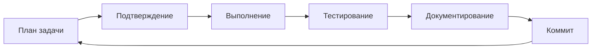

# 🔄 Рабочий процесс разработки CFM Bot

## 📋 Использование WORKLOG.md

Файл `WORKLOG.md` - это наша оперативная память для отслеживания текущих задач.

### Как работать с WORKLOG:

1. **Claude предлагает задачу** → записывает в WORKLOG с планом
2. **Разработчик подтверждает** → Claude меняет статус на "В работе"
3. **Claude выполняет** → обновляет статус на "Выполнено"
4. **Переход к следующей задаче** → повторяем цикл

### Структура записи задачи:

```markdown
### ⏳ HH:MM - [Название задачи]
**План**: Что будем делать
**Шаги**:
1. Шаг 1
2. Шаг 2
**Статус**: 🔄 ОЖИДАЕТ → 🚧 В РАБОТЕ → ✅ ВЫПОЛНЕНО
```

## 🎯 Приоритеты задач

### 🔴 Критические (P1)
- Блокирующие проблемы
- Критические баги
- Настройка инфраструктуры

### 🟡 Важные (P2)
- Основная функциональность
- Интеграции
- Тестирование

### 🟢 Желательные (P3)
- Улучшения
- Документация
- Оптимизация

## 📊 Метрики эффективности

- **Задач за сессию**: Целевое значение 5-10
- **Среднее время на задачу**: 15-30 минут
- **Процент успешных задач**: >90%

## 🔄 Цикл разработки



## 💡 Best Practices

1. **Одна задача за раз** - фокус на текущей задаче
2. **Четкие критерии завершения** - что считается "готово"
3. **Документирование на ходу** - обновляем WORKLOG сразу
4. **Регулярные коммиты** - после каждой завершенной задачи
5. **Обратная связь** - фиксируем проблемы и решения

---

**Документ обновлен**: 4 сентября 2025