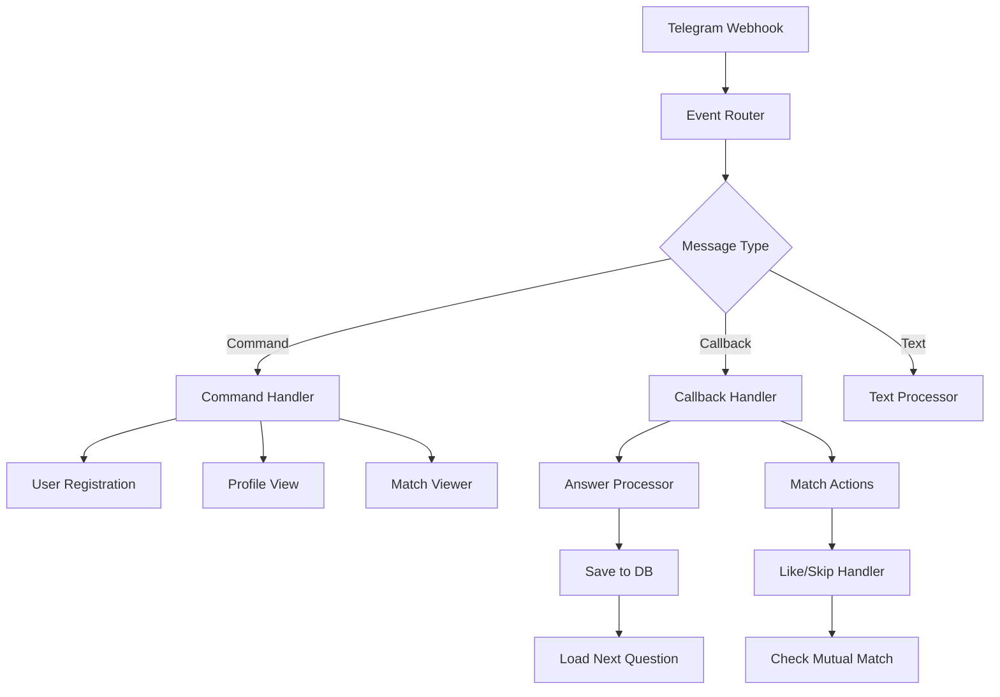

# 📋 CFM Bot Workflow Documentation

## Workflow Architecture



## Core Workflows

### 1. Main Router Workflow

**Purpose**: Central hub for all incoming messages

**Nodes**:
1. **Telegram Trigger**
   - Receives webhooks
   - Handles messages and callbacks
   
2. **Event Router (Code)**
   ```javascript
   // Identify message type
   if (telegram.callback_query) {
     return {type: 'callback', ...}
   } else if (telegram.message?.text?.startsWith('/')) {
     return {type: 'command', ...}
   } else {
     return {type: 'text', ...}
   }
   ```

3. **Message Router (Switch)**
   - Routes to appropriate workflow
   - Conditions based on type/command

### 2. User Registration Workflow

**Trigger**: `/start` command

**Flow**:
1. Check if user exists
2. If new:
   - Create user record
   - Initialize profile
   - Create session
3. If existing:
   - Retrieve state
   - Continue from last point
4. Send appropriate message

**Database Operations**:
```sql
-- Check user
SELECT * FROM users WHERE telegram_id = $1;

-- Create user
INSERT INTO users (telegram_id, username, state)
VALUES ($1, $2, 'new')
RETURNING *;

-- Create session
INSERT INTO user_sessions (user_id, session_token)
VALUES ($1, $2);
```

### 3. Question Flow Workflow

**Components**:

#### 3.1 Load Question
```javascript
// Get next unanswered question
const query = `
  SELECT q.* FROM questions q
  LEFT JOIN user_answers ua 
    ON q.id = ua.question_id 
    AND ua.user_id = $1
  WHERE ua.id IS NULL
  ORDER BY q.batch_number, q.order_index
  LIMIT 1
`;
```

#### 3.2 Format Question with Keyboard
```javascript
const keyboard = {
  inline_keyboard: [
    // Answer options
    options.map(opt => ({
      text: opt.text,
      callback_data: `answer_${questionId}_${opt.value}`
    })),
    // Navigation
    [
      {text: "⏭ Skip", callback_data: `skip_${questionId}`}
    ]
  ]
};
```

#### 3.3 Process Answer
```javascript
// Parse callback data
const [action, questionId, value] = callbackData.split('_');

if (action === 'answer') {
  // Save answer
  await saveAnswer(userId, questionId, value);
  // Ask importance
  await askImportance(chatId, questionId);
} else if (action === 'skip') {
  // Mark as skipped
  await markSkipped(userId, questionId);
  // Load next
  await loadNextQuestion(userId);
}
```

### 4. Matching Engine Workflow

**Trigger**: Batch completion or scheduled

**Algorithm**:
```javascript
function calculateMatchScore(user1, user2) {
  let totalScore = 0;
  let totalWeight = 0;
  
  for (const answer1 of user1.answers) {
    const answer2 = user2.answers.find(a => 
      a.questionId === answer1.questionId
    );
    
    if (answer2) {
      // Check if answers match preferences
      const matchesUser2Pref = 
        answer1.myAnswer === answer2.partnerAnswer ||
        answer2.partnerAnswer === 'any';
      
      const matchesUser1Pref = 
        answer2.myAnswer === answer1.partnerAnswer ||
        answer1.partnerAnswer === 'any';
      
      if (matchesUser2Pref) {
        totalScore += answer2.importance * question.weight;
      }
      if (matchesUser1Pref) {
        totalScore += answer1.importance * question.weight;
      }
      
      totalWeight += 
        (answer1.importance + answer2.importance) * 
        question.weight;
    }
  }
  
  return totalWeight > 0 ? 
    (totalScore / totalWeight) * 100 : 0;
}
```

### 5. Match Viewer Workflow

**Components**:

#### 5.1 Load Matches
```sql
SELECT 
  m.*,
  u.username,
  u.full_name,
  up.bio,
  up.skills
FROM matches m
JOIN users u ON u.id = m.user2_id
LEFT JOIN user_profiles up ON up.user_id = u.id
WHERE m.user1_id = $1
  AND m.status = 'pending'
ORDER BY m.match_score DESC
LIMIT 1;
```

#### 5.2 Format Match Card
```javascript
const matchCard = `
🎯 **${match.score}% Match**

👤 **${match.username}**
${match.bio || 'No bio yet'}

💼 **Skills**: ${match.skills.join(', ')}
📍 **Location**: ${match.location}

_Swipe to see next match_
`;

const keyboard = {
  inline_keyboard: [[
    {text: "❤️ Like", callback_data: `like_${matchId}`},
    {text: "👎 Skip", callback_data: `skip_${matchId}`}
  ]]
};
```

## Workflow Best Practices

### Error Handling

Always wrap database operations:
```javascript
try {
  const result = await db.query(sql, params);
  return result;
} catch (error) {
  console.error('Database error:', error);
  // Send error message to user
  await sendMessage(chatId, 'Something went wrong. Please try again.');
  throw error;
}
```

### Session Management

```javascript
// Check session validity
const session = await getSession(userId);
if (!session || session.isExpired()) {
  await createNewSession(userId);
}

// Update last activity
await updateLastActivity(userId);
```

### Rate Limiting

```javascript
const rateLimiter = {
  attempts: new Map(),
  
  check(userId) {
    const now = Date.now();
    const userAttempts = this.attempts.get(userId) || [];
    
    // Filter attempts in last minute
    const recentAttempts = userAttempts.filter(
      time => now - time < 60000
    );
    
    if (recentAttempts.length >= 30) {
      return false; // Rate limit exceeded
    }
    
    recentAttempts.push(now);
    this.attempts.set(userId, recentAttempts);
    return true;
  }
};
```

## Workflow Variables

### Global Variables
```javascript
$env.TELEGRAM_BOT_TOKEN    // Bot token
$env.DB_CONNECTION_STRING  // Database connection
$env.WEBHOOK_URL          // Webhook endpoint
```

### Node References
```javascript
$node["Node Name"].json   // Access previous node data
$json                     // Current node data
$items                    // Array of all items
$workflow                 // Workflow metadata
```

## Testing Workflows

### Mock Data Generator
```javascript
// Generate test message
function mockTelegramMessage(text, userId = 123456) {
  return {
    message: {
      message_id: Math.floor(Math.random() * 10000),
      from: {
        id: userId,
        username: `user${userId}`,
        first_name: 'Test'
      },
      chat: {
        id: userId,
        type: 'private'
      },
      text: text,
      date: Date.now()
    }
  };
}

// Generate callback query
function mockCallbackQuery(data, userId = 123456) {
  return {
    callback_query: {
      id: Math.random().toString(36),
      from: { id: userId },
      message: {
        message_id: 100,
        chat: { id: userId }
      },
      data: data
    }
  };
}
```

## Workflow Optimization

### Database Queries
- Use prepared statements
- Add appropriate indexes
- Batch operations when possible
- Use connection pooling

### Message Sending
- Queue messages to avoid rate limits
- Use bulk send APIs when available
- Cache frequently used messages

### Memory Management
- Clear large variables after use
- Limit array sizes
- Use streaming for large datasets

---

**Last Updated**: 2025-09-04
**Version**: 1.0.0