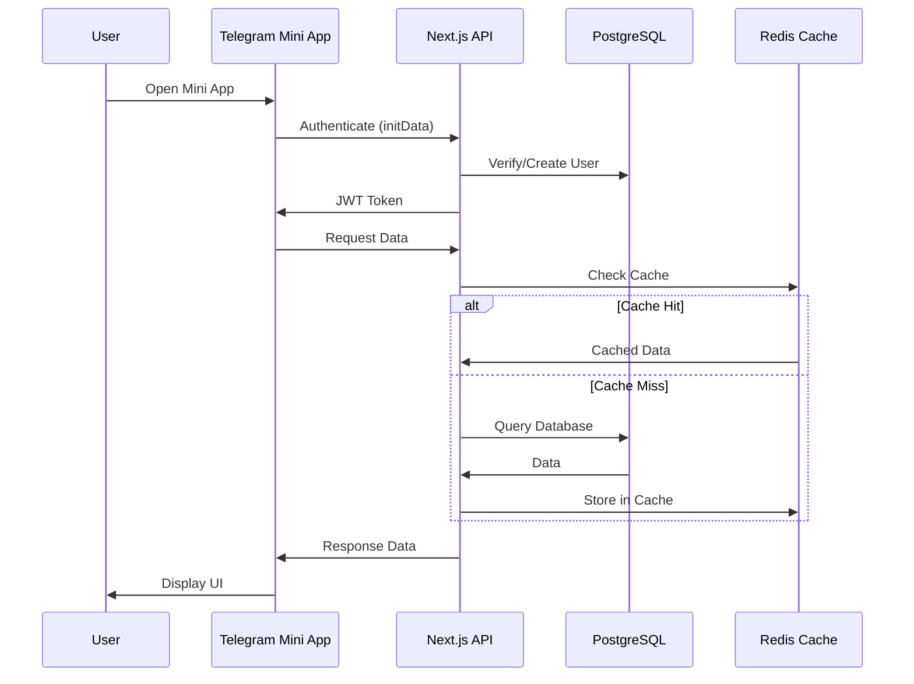

# 🏗️ CFM Bot Architecture v4.0

## Overview

CFM Bot v4.0 represents a complete architectural overhaul, transitioning from a workflow-based n8n system to a modern Next.js application with Telegram Mini App frontend.

## Architecture Principles

1. **Type Safety First** - TypeScript everywhere
2. **Performance Oriented** - Server Components, Edge Functions
3. **Developer Experience** - Hot reload, modern tooling
4. **Scalability** - Serverless, auto-scaling
5. **User Experience** - Native app feel in Telegram

## System Components

### Frontend Layer

#### Telegram Mini App (TWA)
- **Technology**: React 19 + Telegram Web App SDK
- **UI Framework**: Tailwind CSS + shadcn/ui
- **State Management**: Zustand
- **Routing**: React Router
- **Features**:
  - Native Telegram integration
  - Haptic feedback
  - Theme support
  - Offline capabilities

### Backend Layer

#### Next.js 15 Application
- **API Routes**: RESTful endpoints
- **Server Actions**: Direct database mutations
- **WebSocket**: Real-time updates
- **Authentication**: NextAuth + Telegram

### Data Layer

#### PostgreSQL Database
- **ORM**: Prisma
- **Structure**: 38 tables (compatible with v3)
- **Migrations**: Automated with Prisma
- **Caching**: Redis (Vercel KV)

## Request Flow



## Deployment Architecture

```
┌─────────────────────────────────────────────────────────┐
│                       Vercel Edge Network                        │
│                                                                  │
│  ┌────────────────┐  ┌─────────────────┐  ┌────────────────┐ │
│  │   CDN (Static)  │  │  Edge Functions │  │ Serverless Func │ │
│  └────────┬───────┘  └───────┬────────┘  └───────┬───────┘ │
│           │                  │                    │            │
└───────────┼──────────────────┼────────────────────┼────────────┘
            │                  │                    │
     ┌──────┼──────┐   ┌──────┼──────┐      ┌──────┼──────┐
     │ Vercel KV   │   │  Vercel Blob │      │  Supabase   │
     │   (Redis)   │   │  (Storage)   │      │ (PostgreSQL)│
     └─────────────┘   └──────────────┘      └─────────────┘
```

## Service Architecture

### Core Services

#### AuthService
- Telegram authentication validation
- JWT token generation/validation
- Session management
- Permission checking

#### QuestionsService
- Question retrieval logic
- Answer submission
- Progress tracking
- Batch management

#### MatchingService
- Compatibility calculation
- Match creation
- Score algorithms
- Filter application

#### NotificationService
- Push notifications
- Email notifications
- In-app notifications
- Notification preferences

### Supporting Services

#### AnalyticsService
- Event tracking
- Metrics aggregation
- Report generation
- User behavior analysis

#### PaymentService
- Stripe integration
- Robokassa integration
- Subscription management
- Payment webhooks

#### CacheService
- Redis operations
- Cache invalidation
- TTL management
- Cache warming

## Security Architecture

### Authentication Flow

1. User opens Telegram Mini App
2. TWA sends initData to backend
3. Backend validates initData signature
4. Backend creates/updates user record
5. Backend generates JWT token
6. TWA stores token securely
7. All subsequent requests include JWT

### Security Measures

- **Data Validation**: Zod schemas for all inputs
- **SQL Injection Protection**: Prisma ORM
- **XSS Protection**: React's built-in escaping
- **CSRF Protection**: SameSite cookies
- **Rate Limiting**: Vercel Edge Middleware
- **Secrets Management**: Environment variables
- **HTTPS Only**: Enforced by Vercel

## Performance Optimizations

### Frontend
- Code splitting
- Lazy loading
- Image optimization
- Bundle size optimization
- Service Worker caching

### Backend
- Server Components
- Edge Functions
- Database connection pooling
- Query optimization
- Response caching

### Database
- Indexed columns
- Query optimization
- Connection pooling
- Read replicas (future)

## Monitoring & Observability

### Metrics
- Vercel Analytics
- Custom metrics
- Performance monitoring
- Error tracking (Sentry)

### Logging
- Structured logging
- Log aggregation
- Error reporting
- Audit trails

### Alerting
- Uptime monitoring
- Error rate alerts
- Performance degradation
- Security incidents

## Scalability Strategy

### Horizontal Scaling
- Serverless functions auto-scale
- Database read replicas
- CDN for static assets
- Edge function distribution

### Vertical Scaling
- Vercel Pro/Enterprise plans
- Database tier upgrades
- Redis cluster mode
- Dedicated resources

## Disaster Recovery

### Backup Strategy
- Daily database backups
- Point-in-time recovery
- Configuration backups
- Code repository backups

### Recovery Procedures
- Rollback procedures
- Database restoration
- Service degradation plans
- Communication protocols

## Migration from v3

### Database Migration
- Schema remains compatible
- Data migration scripts
- Rollback procedures
- Zero-downtime migration

### Feature Migration
- Phased rollout
- Feature flags
- A/B testing
- Gradual user migration

## Future Considerations

### Planned Enhancements
- GraphQL API
- Mobile apps (iOS/Android)
- AI/ML matching improvements
- Multi-language support
- Advanced analytics

### Technical Debt
- WebSocket implementation
- Payment system migration
- Admin panel completion
- Test coverage improvement

---

*This document is actively maintained and updated as the architecture evolves.*
